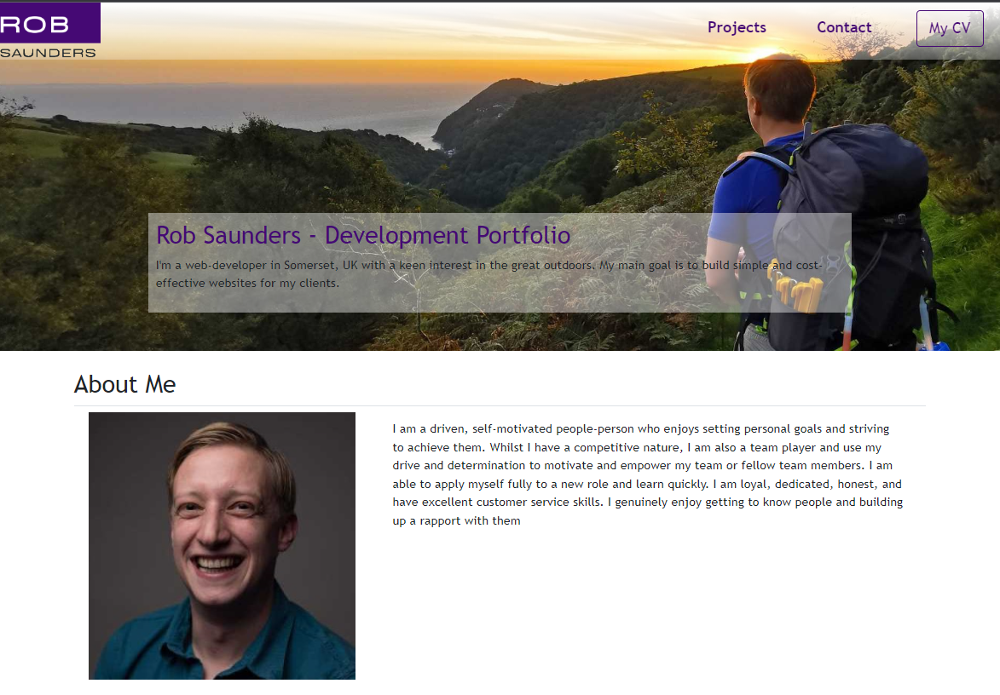

# Rob's React Portfolio

## Table of Contents

- [Project Description](#Description)
- [Installation](#Installation)
- [Usage](#Usage)
- [License](#License)
- [Contributing](#Contributing)
- [Testing](#Testing)
- [Questions](#Questions)

## Description
Welcome to my React-powered super portfolio; the MACH-3 of my portfolios, bigger, better and more powerful than ever! I liked the design of my current portfolio so have taken many elements from it but this time, it's a single page app!!! The majority of content is not even contained on the page itself, rather, it is 'pulled' through a component that renders the objects. This was AMAZING to build and stretched my knowledge to the very limits but was the BEST thing I could have done. It uses a well-balanced mix of Bootstrap, custom CSS, Components and Functions as well JSON files to provide content. 

Here is a screenshot of my app:

## Installation
View the website here: https://r0bsaunders.github.io/rob-saunders-react-portfolio/#/ and view the repo here: https://github.com/R0bsaunders/rob-saunders-react-portfolio

## Usage
Use this website and repo to see how far I have come in my journey to learn code.

## Contributors
Email me at me@rob-saunders.co.uk

## Testing
I have tested this on all screen sizes. I am aware of a number of issues relating to the navigation button on mobiles and the project cards on small screens but otherwise, the build is bug-free

## Questions
You can get in touch by using the following:

### GitHub
**[R0bsaunders](https://github.com/R0bsaunders)**

### Email
**[me@rob-saunders.co.uk](me@rob-saunders.co.uk)**

## License
This code is distributed under the MIT License.
